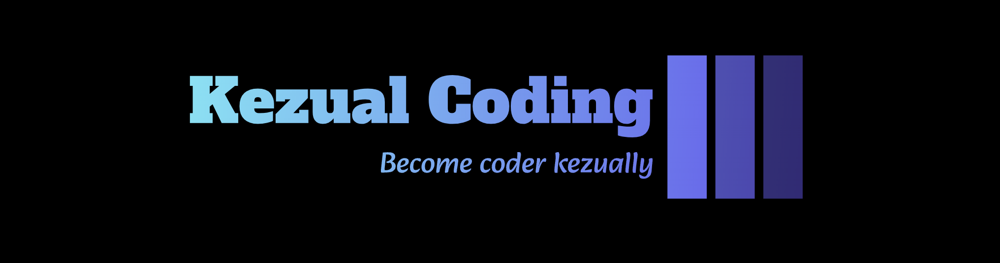

# Kezual Coding



## Table of Contents

1. [About The Project](#about-the-project)
2. [Getting Started](#getting-started)
    - [Prerequisites](#prerequisites)
    - [Installation](#installation)
3. [Usage](#usage)
4. [Roadmap](#roadmap)
5. [Contributing](#contributing)
6. [License](#license)
7. [Contact](#contact)
8. [Acknowledgements](#acknowledgements)

## About The Project

Kezual Coding is designed to provide valuable resources and tools to students worldwide, helping them excel in various fields, including Frontend, Backend, and Competitive Programming. Here's a detailed overview of what our platform offers:

- **Comprehensive Learning Resources**
  - **Frontend Development**: Tutorials, projects, and playgrounds to experiment and learn.
  - **Backend Development**: Step-by-step guides and projects to master backend technologies.
  - **Competitive Programming**: In-depth tutorials and practice problems to sharpen your skills.

- **Interactive Project Playgrounds**
  - Run and test your code in real-time within our interactive playgrounds.
  - Experiment with various coding projects across different domains.

- **Competitions and Tutorials**
  - Participate in coding competitions to challenge yourself and win prizes.
  - Access a wide range of tutorials to learn new concepts and improve your skills.

- **Statistics Page**
  - Gather and analyze your performance data from popular coding platforms like Codeforces and Leetcode.
  - Visualize your progress and identify areas for improvement.

- **AI-Powered Chatbot**
  - Receive personalized feedback on your strengths and weaknesses.
  - Get custom-tailored questions to practice and improve your weak points.

- **Engaging Games**
  - Take a break and enjoy fun games directly on the site.
  - Enhance your problem-solving skills while having fun.

- **AI-Organized To-Do App**
  - View and manage your daily tasks efficiently with the help of AI.
  - Stay organized and focused on your learning goals.

## Features Overview

1. **Learning Resources**
   - Diverse and comprehensive content for Frontend, Backend, and Competitive Programming.
   - Hands-on projects and real-world applications.

2. **Interactive Playgrounds**
   - Test and debug your code in a simulated environment.
   - Instant feedback and code execution.

3. **Competitions**
   - Regularly organized coding contests.
   - Leaderboards and rewards.

4. **Statistics Page**
   - Integration with Codeforces, Leetcode, and other platforms.
   - Detailed performance analytics.

5. **AI Chatbot**
   - Personalized learning path recommendations.
   - Custom question sets based on your performance.

6. **Games**
   - Engaging and educational games to improve cognitive skills.
   - Variety of games to keep you entertained.

7. **To-Do App**
   - AI-powered task management.
   - Daily, weekly, and monthly task views.

## Why Choose Our Platform?

- **Holistic Learning Approach**: Comprehensive resources covering multiple aspects of software development and competitive programming.
- **Personalized Learning**: AI-driven insights and recommendations tailored to your unique strengths and weaknesses.
- **Interactive and Engaging**: Hands-on projects, real-time code testing, competitions, and games to keep you motivated.
- **Organized and Efficient**: AI-organized to-do app to help you stay on top of your learning journey.

Join us today and take your coding skills to the next level!


## Getting Started

### Prerequisites
Before you begin, ensure you have met the following requirements:

- **Node.js**: You can download it from [Node.js official website](https://nodejs.org/).
- **npm**: Node.js installation includes npm (Node Package Manager).

```bash
npm install npm@latest -g

```
### Installation 

1. #### Clone The Repo

```bash 
git clone https://github.com/kezualCoding/kezualcoding-react
```
2. #### Navigate to project 
```bash
cd kezualcoding-react
```
3. #### Install NPM packages
```bash
npm i
```
or 
```bash
npm install
```
4. #### Start The project on Local
```bash
npm start 
```

## Usage 

We are currently working on the projects will get more update before August (End of August)

## Contributing 

Contributions are what make the open source community such an amazing place to learn, inspire, and create. Any contributions you make are **greatly appreciated**.

1. Fork the Project
2. Create your Feature Branch (`git checkout -b feature/AmazingFeature`)
3. Commit your Changes (`git commit -m 'Add some AmazingFeature'`)
4. Push to the Branch (`git push origin feature/AmazingFeature`)
5. Open a Pull Request


## License

This project is licensed under the Creative Commons Attribution-NonCommercial 4.0 International (CC BY-NC 4.0) License. You are free to:

- **Share**: Copy and redistribute the material in any medium or format.
- **Adapt**: Remix, transform, and build upon the material.

Under the following terms:

- **Attribution**: You must give appropriate credit, provide a link to the license, and indicate if changes were made. You may do so in any reasonable manner, but not in any way that suggests the licensor endorses you or your use.
- **NonCommercial**: You may not use the material for commercial purposes If you want to use it commercially please contact [kezualCoding](#contact-information).

For more details, see the [LICENSE](./LICENSE) file.

### All rights reserved by Kezual Coding.


## Contact Information

### Kezual Coding
- **X (formerly Twitter)**: [@kezual_coding](https://x.com/kezual_coding)
- **Instagram**: [@kezual_coding](https://www.instagram.com/kezual_coding/)
- **Email**: kezualcoding@gmail.com

### Team Members

#### Yashi Gupta (Founder, Kezual Coding)
- **Email**: guptayashi11503@gmail.com

#### Vaiditya Tanwar (Co-Founder, Kezual Coding)
- **X (formerly Twitter)**: [@vaiditya2501](https://x.com/vaiditya2501)
- **Email**: vaidityatanwar2207@gmail.com

## Acknowledgements

## Acknowledgements

* [React](https://reactjs.org/) - For providing a powerful library to build our frontend.
* [Node.js](https://nodejs.org/) - For enabling our backend development with JavaScript.
* [Express](https://expressjs.com/) - For simplifying the process of building server-side applications.
* [MongoDB](https://www.mongodb.com/) - For offering a flexible and scalable database solution.
* [Firebase](https://firebase.google.com/) - For backend services including authentication, database, and hosting.
* [Gemini](https://gemini.google.com/) - For its versatile LLM API and services that contributed to our project.
* [Codeforces](https://codeforces.com/) and [LeetCode](https://leetcode.com/) - For their APIs that help us fetch user data and statistics.
* [OpenAI GPT](https://openai.com/) - For powering the AI chat bot that analyzes user strengths and weaknesses.
* [GitHub](https://github.com/) - For hosting our project repository and providing collaborative tools.
* [Netlify](https://www.netlify.com/) - For providing hosting and continuous deployment services.
* [Font Awesome](https://fontawesome.com/) - For providing beautiful icons to enhance our UI.
* [Stack Overflow](https://stackoverflow.com/) - For being an invaluable resource for troubleshooting and development tips.
* [Google Cloud](https://cloud.google.com/) - For hosting and other cloud services.
* [Heroku](https://www.heroku.com/) - For easy deployment and scaling of our applications.
* [MDN Web Docs](https://developer.mozilla.org/) - For comprehensive documentation on web technologies.
* Special thanks to our early users and beta testers for their invaluable feedback and support.


